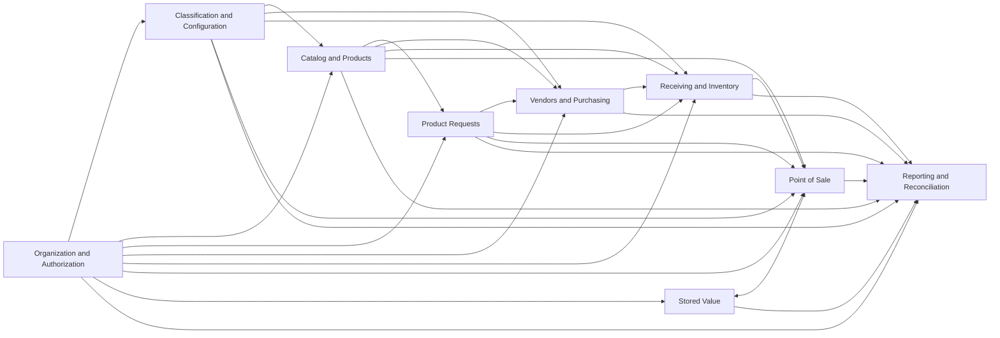
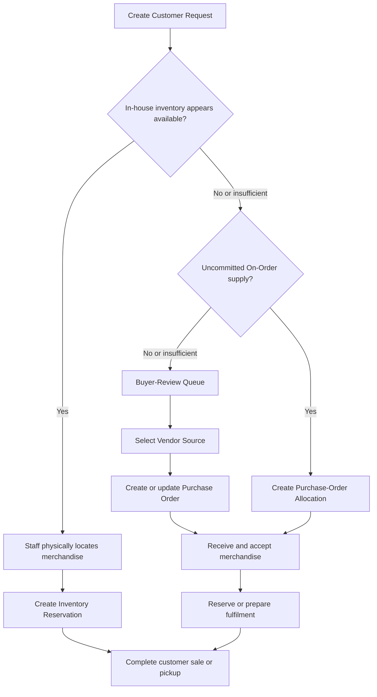
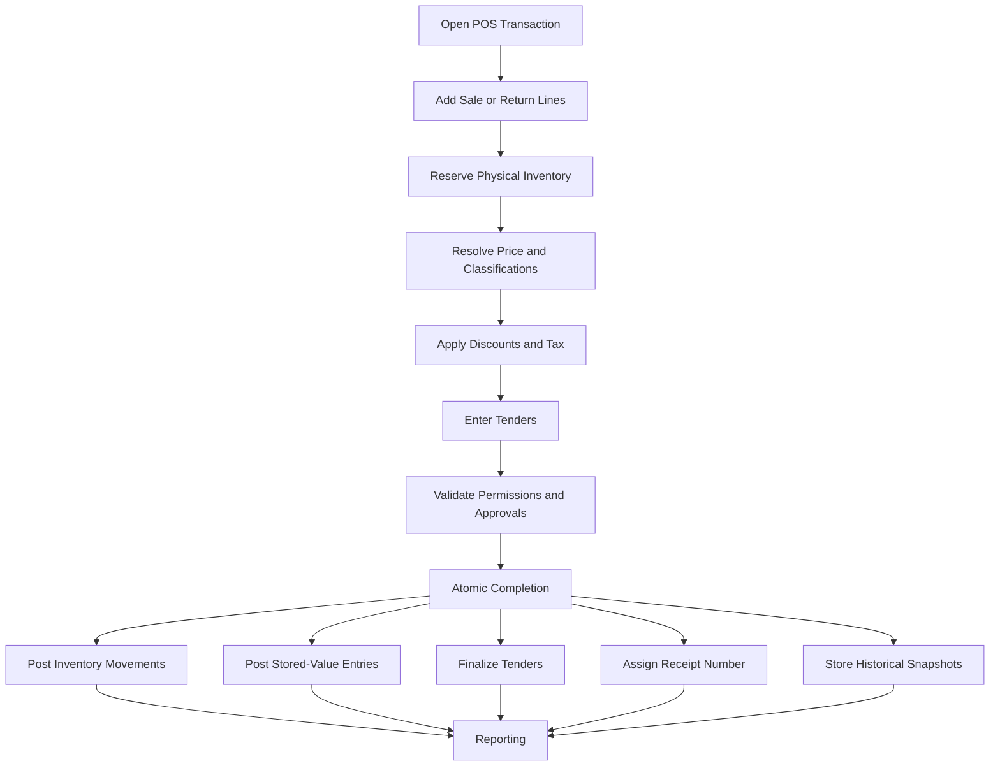
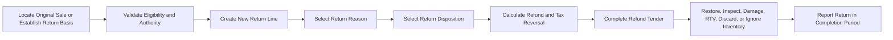
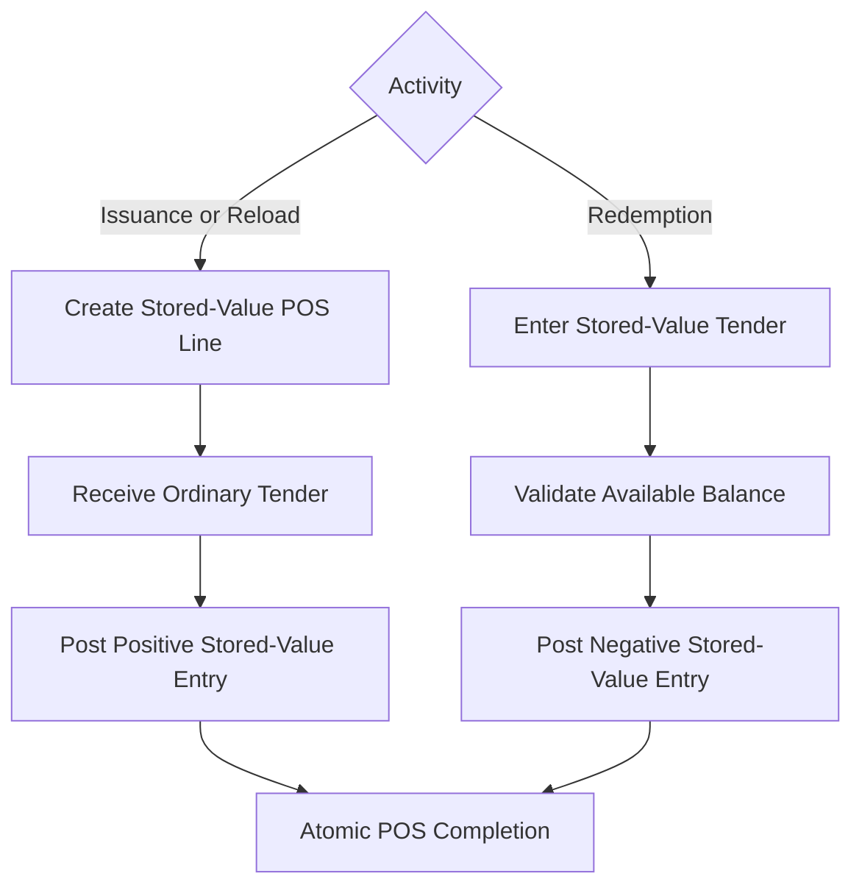

# ShelfStack Domain Map

**Status:** Governing architectural map
**Purpose:** Define ShelfStack’s business domains, ownership boundaries, dependencies, and cross-domain interactions
**Related documents:**

* [System Overview](system-overview.md)
* [Architectural Decision Records](../adr/README.md)
* [Domain Specifications](../domains/README.md)
* [Glossary](../glossary.md)
* [Schema Documentation](../schema/README.md)
* [Implementation Roadmap](../implementation/roadmap.md)

---

## 1. Purpose

ShelfStack is divided into business domains so that each major part of the system has a clear responsibility.

A domain:

* owns specific records and business rules;
* preserves its own operational and audit history;
* exposes information or controlled operations to other domains;
* references, but does not duplicate, records owned elsewhere;
* participates in cross-domain workflows through explicit services, postings, and references.

The domain map defines **who owns what**.

It does not define every table, field, screen, service class, or implementation module. Those details belong in the Domain Specifications, Schema Documentation, and implementation.

---

## 2. Domain overview

ShelfStack currently consists of nine principal domains.

| Domain                           | Primary responsibility                                                          |
| -------------------------------- | ------------------------------------------------------------------------------- |
| Organization and Authorization   | Who may act, at which Store, and within what authority                          |
| Classification and Configuration | Shared classifications, policies, reasons, and Store-specific operating rules   |
| Catalog and Products             | What merchandise or service exists and which exact configuration is operational |
| Product Requests                 | What customers or staff want the Store to obtain or fulfil                      |
| Vendors and Purchasing           | What the Store intends to acquire and from whom                                 |
| Receiving and Inventory          | What merchandise arrived, was accepted, and is physically owned by each Store   |
| Point of Sale                    | How merchandise, services, returns, tax, and Tenders are completed at checkout  |
| Stored Value                     | How Gift Cards, Store Credit, and Trade Credit balances are governed            |
| Reporting and Reconciliation     | How posted activity is summarized, compared, and audited                        |

---

## 3. High-level domain relationships



The arrows indicate that one domain supplies records, decisions, or services used by another. They do not imply that the consuming domain may modify the supplying domain’s records directly.

---

# 4. Domain definitions

## 4.1 Organization and Authorization

### Purpose

The Organization and Authorization domain establishes the operating context in which all other domains act.

It answers:

* Which Organization owns this installation?
* Which Stores exist?
* Which User is acting?
* At which Store may the User act?
* Which Permissions does the User possess?
* What numeric Authority Limits apply?
* Was a restricted action approved?
* Which POS Device and Cash Drawer are involved?

### Owns

* Organization;
* Store;
* User;
* Store Membership;
* Role;
* Permission;
* Role-Permission assignment;
* Authority Limit;
* POS Device;
* Cash Drawer;
* Approval;
* authentication and audit identity.

### Provides to other domains

* active Organization context;
* active Store context;
* authenticated User;
* effective Store Membership;
* effective Permissions;
* effective numeric Authority Limits;
* Approval validation;
* active Device and Drawer validation.

### Does not own

* Products;
* inventory;
* Purchase Orders;
* POS Transactions;
* Stored-Value balances;
* reports created from operational activity.

### Principal invariants

* One installation represents one operating Organization.
* A Store belongs to one Organization.
* Store access requires an active Store Membership.
* Default Store is a navigation preference and does not grant access.
* Role names do not control application behavior.
* Permissions are evaluated in Store context.
* Permission and numeric Authority are separate.
* An Approval retains both requester and approver.
* A POS Device belongs to one Store.
* A Cash Drawer belongs to one Store.
* A Cash Drawer has at most one active cash-enabled POS Session.

### Governing ADRs

* [ADR-0010: Business Days, Sessions, Devices, Drawers, and Z Reports](../adr/0010-business-days-sessions-and-z-reports.md)
* [ADR-0011: Permissions, Authority, and Approvals](../adr/0011-permissions-authority-and-approvals.md)

---

## 4.2 Classification and Configuration

### Purpose

The Classification and Configuration domain owns shared structures that define how merchandise and operational activity are categorized or governed.

It answers:

* Where and how is merchandise merchandised?
* Which Department normally applies?
* How is the item treated for tax?
* Which Return Policy applies?
* Which Tender Types are available?
* Which reasons and operating rules are valid?
* Which defaults apply at a Store?

### Owns

* Merchandise Class hierarchy;
* Department;
* Tax Category;
* Store Tax Rate;
* Store Tax Rule;
* Return Policy;
* Return Reason;
* Discount Reason;
* Price-Override Reason;
* Cancellation Reason;
* Post-Void Reason;
* Tender Type;
* Cash-Movement Type;
* Store operational configuration;
* future accounting mappings.

### Merchandise Class responsibility

The Merchandise Class hierarchy provides:

* shelving and merchandising organization;
* browsing hierarchy;
* buyer organization;
* category reporting;
* default Department resolution;
* shelving guidance;
* merchandising notes.

The separate Display Category hierarchy is not part of the accepted architecture.

### Department responsibility

Departments provide broad financial and selling-policy defaults such as:

* general-ledger mappings;
* Tax Category;
* Return Policy;
* maximum merchandise Discount;
* financial and managerial reporting classification.

### Does not own

* Product descriptions;
* Product Variant SKUs;
* Store inventory quantities;
* exact-copy Condition;
* exact-copy cost;
* actual completed tax amounts;
* completed POS history.

### Principal invariants

* Merchandise Class and Department remain distinct.
* Merchandise Class may resolve a default Department.
* Product and Product Variant overrides remain possible where explicitly supported.
* Department does not determine Inventory-Tracking Mode.
* Product Type does not directly determine tax or inventory behavior.
* Temporary placement does not change inventory ownership.
* Completed activity snapshots the classifications used at completion.
* Current classification changes do not rewrite completed history.

### Governing ADRs

* [ADR-0003: Merchandise Classes and Department Defaults](../adr/0003-merchandise-classes-and-departments.md)
* [ADR-0011: Permissions, Authority, and Approvals](../adr/0011-permissions-authority-and-approvals.md)

---

## 4.3 Catalog and Products

### Purpose

The Catalog and Products domain defines what ShelfStack recognizes as a commercial item and which exact configuration may be sold, purchased, received, or inventoried.

It answers:

* What is the Product?
* What is its canonical identity?
* Which Product Variants exist?
* Which Variant is sellable or purchasable?
* How is inventory tracked?
* Which Format and Condition apply?
* Which current price and policy inputs are available?
* How should a scanned identifier resolve?

### Owns

* Product;
* Product Variant;
* canonical Product Identifier;
* Alternate Identifier;
* generated Product Variant SKU;
* Product Type;
* Format;
* Condition definitions;
* Variant options and matrices;
* Inventory-Tracking Mode;
* Product and Variant activation;
* Product and Variant sellability;
* Product and Variant purchasability;
* current regular-price inputs;
* sale-eligibility inputs;
* Product lookup and scan resolution.

### Merchandise hierarchy

```text
Product
└── Product Variant
    └── Inventory Unit, when individual tracking applies
```

The Catalog domain owns Products and Product Variants.

The Receiving and Inventory domain owns operational Inventory Units.

### Provides to other domains

* Product identity;
* Product Variant identity;
* SKU resolution;
* canonical identifier resolution;
* Product metadata;
* Inventory-Tracking Mode;
* sale and purchase eligibility;
* current classification and price inputs;
* Format and Condition definitions.

### Does not own

* Store Stock Balances;
* On-Hand quantity;
* Inventory Reservations;
* Inventory Unit operational status;
* Purchase Orders;
* completed POS snapshots;
* Tender activity.

### Principal invariants

* Every Product has one canonical identifier.
* Every sellable Product has at least one Product Variant.
* Every Product Variant belongs to one Product.
* Every Product Variant has one immutable `28` EAN-13 SKU.
* A Product is not sold directly.
* Inventory-Tracking Mode is explicit on the Product Variant.
* Quantity-tracked merchandise does not create one Inventory Unit per copy.
* Individually tracked merchandise requires an exact Inventory Unit for sale.
* Current Catalog changes do not rewrite completed operational history.

### Governing ADRs

* [ADR-0001: Product, Product Variant, and Inventory Unit](../adr/0001-product-variant-inventory-unit.md)
* [ADR-0002: Canonical Identifiers and Namespaces](../adr/0002-canonical-identifiers-and-namespaces.md)
* [ADR-0003: Merchandise Classes and Department Defaults](../adr/0003-merchandise-classes-and-departments.md)

---

## 4.4 Product Requests

### Purpose

The Product Requests domain records demand that the Store may attempt to fulfil.

It provides one model for:

* Customer Requests;
* staff purchasing suggestions;
* future automated replenishment suggestions;
* buyer-review demand;
* fulfilment status.

It answers:

* What does a customer or staff member want?
* Which quantity is requested?
* Is a specific Product Variant required?
* How much demand has been covered?
* How much remains for buyer action?
* Which current or expected supply has been committed?

### Owns

* Product Request;
* request type;
* requested quantity;
* request priority;
* needed-by date;
* requesting User;
* Customer relationship, when applicable;
* request notes;
* request status;
* fulfilment summary;
* relationships to supply allocations.

### Initial request types

```text
customer_request
staff_suggestion
stock_replenishment
frontlist_selection
```

A future type may include:

```text
system_replenishment_suggestion
```

Every Product Request requires an existing Product (`product_id`). Variant may be nullable until purchasing or exact fulfilment requires it ([ADR-0015](../adr/0015-product-backed-demand-and-customer-supply-commitments.md)).

### References but does not own

* Product and Product Variant;
* Customer, when later implemented (v1 uses opaque `customer_reference`);
* Inventory Reservations;
* Purchase-Order Allocations (Customer Requests only);
* Purchase Orders;
* Receipts;
* POS Transactions / fulfilment facts used to fulfil requests.

### Supply coverage

A **Customer Request** may be covered by:

1. confirmed in-house Inventory Reservations;
2. remaining Purchase-Order Allocations;
3. remaining unfulfilled quantity sent to buyer review.

```text
unfulfilled request quantity =
requested quantity
- confirmed in-house reservations
- remaining purchase-order allocations
```

Non-customer requests do not ordinarily retain Purchase-Order Allocations after the buyer resolves them.

### Principal invariants

* A Product Request represents demand, not supply.
* Every Product Request references an existing Product.
* A Customer Request does not prove that inventory exists.
* Staff Suggestions, stock replenishment, and frontlist selections do not create customer obligations.
* In-house inventory must be physically confirmed before Reservation.
* Future supply committed to a customer is represented by a Purchase-Order Allocation, not an Inventory Reservation.
* Supply may not be committed beyond its available or unallocated quantity.

### Governing ADRs

* [ADR-0015: Product-Backed Demand and Customer Supply Commitments](../adr/0015-product-backed-demand-and-customer-supply-commitments.md) (supersedes ADR-0005)
* [ADR-0006: Inventory Quantities and Reservation Records](../adr/0006-inventory-quantities-and-reservation-records.md)

---

## 4.5 Vendors and Purchasing

### Purpose

The Vendors and Purchasing domain records the Store’s intent to acquire merchandise.

It answers:

* Which Vendor supplies the merchandise?
* Which Vendor code and expected cost apply?
* What quantity did the Store intend to order?
* Which Store will receive the merchandise?
* How much remains On Order?
* Which Product Requests are expected to be fulfilled by this order?

### Owns

* Vendor;
* Vendor contact and ordering information;
* Product-Variant Vendor Source;
* Vendor item code;
* expected Vendor cost;
* preferred-source status;
* Purchase Order;
* Purchase-Order Line;
* ordered quantity;
* cancelled quantity;
* expected delivery;
* Purchase-Order Allocation;
* Purchasing history.

### References but does not own

* Product;
* Product Variant;
* Store;
* Product Request;
* Receipt;
* accepted quantity;
* On-Hand inventory;
* actual posted inventory cost.

### Purchase-order role

A Purchase Order represents acquisition intent.

It:

* belongs to one receiving Store;
* normally belongs to one Vendor;
* contains Product-Variant-level lines;
* contributes to On Order;
* does not change On Hand.

### Purchase-order allocation

A Purchase-Order Allocation connects expected future supply to a Customer Request.

It does not create:

* On-Hand inventory;
* Available inventory;
* a physical Inventory Reservation.

### Principal invariants

* A Purchase Order belongs to one Store.
* A Purchase Order normally belongs to one Vendor.
* An ordinary Purchase-Order Line identifies one Product Variant.
* Purchasing does not change On Hand.
* Only unreceived and uncancelled expected quantity contributes to On Order.
* Purchase-Order Allocations may not exceed uncommitted open quantity.
* Receiving, not Purchasing, creates inventory.
* Historical Purchase Orders retain necessary Product and Vendor snapshots.

### Governing ADRs

* [ADR-0015: Product-Backed Demand and Customer Supply Commitments](../adr/0015-product-backed-demand-and-customer-supply-commitments.md)
* [ADR-0007: Purchasing, Receiving, and Inventory Events](../adr/0007-purchasing-receiving-and-inventory-events.md)
* [ADR-0011: Permissions, Authority, and Approvals](../adr/0011-permissions-authority-and-approvals.md)

---

## 4.6 Receiving and Inventory

### Purpose

The Receiving and Inventory domain is the authoritative source for physical merchandise owned by each Store.

It answers:

* What physically arrived?
* What quantity did the Store accept?
* What merchandise does the Store currently own?
* Which quantity is Reserved, Unavailable, or Available?
* Which exact physical copy exists?
* What cost applies?
* Which movements explain the current balance?

### Owns

* Receipt;
* Receipt Line;
* accepted and rejected receiving quantities;
* Inventory Unit;
* Unit Identifier;
* Stock Balance;
* On Hand;
* Reserved;
* Unavailable;
* Available;
* inventory cost;
* Inventory Reservation;
* Inventory Ledger Entry;
* Inventory Adjustment;
* inventory availability status;
* inventory acquisition source;
* future Inventory Count, transfer, and RTV-holding records.

### Store as inventory boundary

Inventory is authoritative at the Store level.

Internal physical areas such as:

* receiving;
* stockroom;
* sales floor;
* front table;
* cashwrap;

do not own inventory balances.

### Inventory quantities

For quantity-tracked merchandise:

```text
available = on_hand - reserved - unavailable
```

`on_order` is supplied by Purchasing and remains outside physical inventory.

### Receipt role

A Receipt represents one Vendor shipment or receiving event.

One Receipt may contain lines associated with several Purchase Orders.

The Purchase-Order relationship occurs at the Receipt-Line level.

```text
Receipt
├── Receipt Line → Purchase-Order Line from PO 1
├── Receipt Line → Purchase-Order Line from PO 2
├── Receipt Line → Purchase-Order Line from PO 2
└── Unlinked Receipt Line, where authorized
```

### Inventory Reservation role

An Inventory Reservation commits physically present inventory.

It may be created for:

* open POS activity;
* suspended POS activity;
* physically confirmed Customer Requests.

### Provides to other domains

* Store availability;
* Inventory-Tracking fulfillment;
* exact Inventory Unit lookup;
* Reservation operations;
* cost snapshots;
* posted inventory movement;
* last-received information.

### Principal invariants

* Inventory is authoritative by Store.
* Only Inventory Movements change On Hand.
* Reservations reduce Available but not On Hand.
* Unavailable inventory remains part of On Hand.
* On Order is not inventory.
* One Stock Balance exists per Store and quantity-tracked Product Variant.
* One Inventory Unit belongs to one Store at a time.
* One Inventory Unit has at most one active Reservation.
* Only accepted receiving quantity enters inventory.
* Rejected receiving quantity does not increase On Hand.
* A sold or discarded Inventory Unit cannot be sold again without an explicit reversal.

### Governing ADRs

* [ADR-0001: Product, Product Variant, and Inventory Unit](../adr/0001-product-variant-inventory-unit.md)
* [ADR-0002: Canonical Identifiers and Namespaces](../adr/0002-canonical-identifiers-and-namespaces.md)
* [ADR-0004: Store-Level Inventory Boundary](../adr/0004-store-level-inventory-boundary.md)
* [ADR-0015: Product-Backed Demand and Customer Supply Commitments](../adr/0015-product-backed-demand-and-customer-supply-commitments.md)
* [ADR-0006: Inventory Quantities and Reservation Records](../adr/0006-inventory-quantities-and-reservation-records.md)
* [ADR-0007: Purchasing, Receiving, and Inventory Events](../adr/0007-purchasing-receiving-and-inventory-events.md)

---

## 4.7 Point of Sale

### Purpose

The Point-of-Sale domain coordinates checkout activity across Catalog, Classification, Authorization, Inventory, Stored Value, and Reporting.

It answers:

* What is being sold or returned?
* Which prices, Discounts, and taxes apply?
* Which inventory is committed?
* How is the transaction settled?
* Which User and POS Session performed the activity?
* Which Receipt Number identifies the completed transaction?
* How is completed activity corrected?

### Owns

* Business Day;
* Business Date;
* business-day Z number;
* POS Session;
* session Z number;
* POS Transaction;
* POS Line Item;
* line removal;
* suspension and recall;
* Price Override;
* POS Discount;
* Discount Allocation;
* tax component;
* POS Tender;
* cash movement;
* cash count;
* Receipt Number;
* receipt print event;
* Customer Return;
* Post-Void transaction;
* POS correction links.

### Coordinates but does not own

* User, Permission, and Approval;
* Product and Product Variant;
* Merchandise Class, Department, and Tax Category;
* Store inventory and Inventory Reservations;
* Stored-Value Account and Stored-Value Ledger;
* report definitions and Reconciliation.

### Transaction model

A POS Transaction is a checkout container.

It may contain:

* sale lines;
* return lines;
* Product lines;
* Open-Ring Lines;
* Stored-Value lines;
* received Tenders;
* refunded Tenders.

It is not permanently classified as only a sale, return, exchange, or Stored-Value transaction.

### Completion boundary

POS Completion is atomic and idempotent.

Completion coordinates:

* final line values;
* Discounts;
* tax;
* Tenders;
* Inventory Reservations;
* Inventory Movements;
* Inventory Unit statuses;
* Stored-Value Entries;
* cost snapshots;
* Receipt Number assignment;
* transaction completion.

### Corrections

Completed transactions are immutable.

Corrections use:

* new return lines;
* refund Tenders;
* Post-Void transactions;
* inventory reversals;
* Stored-Value reversals;
* Reconciliation resolutions (link domain-owned corrections; do not mutate balances).

### Principal invariants

* A Completed Transaction is immutable.
* A Completed Transaction has one Store Receipt Number.
* Receipt Numbers are assigned only during successful Completion.
* Completion is atomic and idempotent.
* Completed Tender net equals transaction net.
* An individually tracked sale identifies one Inventory Unit.
* Completed activity uses historical snapshots.
* A Customer Return does not modify the original sale line.
* A Post-Void is a new complete reversing transaction.
* A Business Day cannot close while a POS Session remains open.
* Closing and Reconciliation remain separate.

### Governing ADRs

* [ADR-0006: Inventory Quantities and Reservation Records](../adr/0006-inventory-quantities-and-reservation-records.md)
* [ADR-0008: Immutable POS Transactions](../adr/0008-immutable-pos-transactions.md)
* [ADR-0009: Atomic and Idempotent POS Completion](../adr/0009-atomic-idempotent-pos-completion.md)
* [ADR-0010: Business Days, Sessions, Devices, Drawers, and Z Reports](../adr/0010-business-days-sessions-and-z-reports.md)
* [ADR-0011: Permissions, Authority, and Approvals](../adr/0011-permissions-authority-and-approvals.md)
* [ADR-0012: Stored-Value Ledger](../adr/0012-stored-value-ledger.md)

---

## 4.8 Stored Value

### Purpose

The Stored Value domain governs customer-held value that may be issued, reloaded, redeemed, refunded, adjusted, or reversed.

It answers:

* Which Stored-Value Account holds the value?
* What type of value is it?
* What is the current balance?
* Which immutable entries explain the balance?
* May the requested amount be redeemed?
* Which POS activity created or consumed the value?

### Owns

* Stored-Value Account;
* canonical `21` EAN-13 Account Number;
* Alternate Identifier;
* account type;
* account status;
* cached current balance;
* Stored-Value Entry;
* issuance;
* reload;
* redemption;
* refund;
* reversal;
* manual adjustment.

### Initial account types

```text
gift_card
store_credit
trade_credit
```

These types share infrastructure but remain distinct for:

* policy;
* accounting;
* reporting;
* customer communication.

### References but does not own

* POS Transaction;
* POS Line Item;
* POS Tender;
* User;
* Approval;
* future Customer;
* future Buyback transaction.

### Ledger role

The Stored-Value Ledger is append-only and authoritative.

The cached balance exists for performance but must reconcile to the Ledger.

### POS relationship

* Issuance is represented by a Stored-Value POS Line Item.
* Reload is funded through ordinary Tender.
* Redemption is a Tender.
* Refund to Stored Value increases the account balance.
* Stored-Value posting and its related POS activity commit atomically.

### Principal invariants

* Gift Card, Store Credit, and Trade Credit remain distinct.
* Every Stored-Value Account has one canonical `21` identifier.
* Stored-Value Entries are append-only.
* The Ledger is authoritative.
* Issuance creates liability, not ordinary merchandise revenue.
* Redemption is Tender, not a Discount.
* Redemption may not exceed available balance unless a later policy explicitly permits it.
* Stored-Value posting and related POS activity are atomic.
* Corrections create reversing entries.

### Governing ADRs

* [ADR-0002: Canonical Identifiers and Namespaces](../adr/0002-canonical-identifiers-and-namespaces.md)
* [ADR-0008: Immutable POS Transactions](../adr/0008-immutable-pos-transactions.md)
* [ADR-0009: Atomic and Idempotent POS Completion](../adr/0009-atomic-idempotent-pos-completion.md)
* [ADR-0012: Stored-Value Ledger](../adr/0012-stored-value-ledger.md)

---

## 4.9 Reporting and Reconciliation

### Purpose

The Reporting and Reconciliation domain turns posted operational records into reproducible business information.

It answers:

* What happened during a POS Session or Business Day?
* What were Gross Sales, Discounts, returns, tax, and net sales?
* Which Tenders were received or refunded?
* What inventory is held, Reserved, Unavailable, or On Order?
* What were cost and Gross Margin?
* Do internal totals agree with counted or external totals?
* Which exceptions or Approvals require review?

### Owns

* report definitions;
* report queries and projections;
* Session X Reports;
* Session Z Reports;
* Business-Day X Reports;
* Business-Day Z Reports;
* reconciliation records (comparisons, findings, resolutions; close-time external evidence);
* operational exception reporting;
* future accounting-export batches.

### Consumes

* completed POS snapshots;
* POS Tenders;
* cash movements and counts;
* Business Days and POS Sessions;
* Inventory Ledger Entries;
* Stock Balances;
* Inventory Reservations;
* Purchase Orders;
* Receipts;
* Stored-Value Entries;
* Approvals and audit records.

### Does not own or modify

* POS Transactions;
* Tenders;
* Inventory Movements;
* Purchase Orders;
* Receipts;
* Stored-Value Entries;
* Catalog master data.

### Historical attribution

Reports use the values snapshotted when activity was completed or posted.

Current changes to:

* Product;
* Merchandise Class;
* Department;
* Tax Category;
* price;
* cost;
* Return Policy;

do not reinterpret completed activity.

### Reconciliation role

Reconciliation compares expected totals to counted or external totals.

Examples include:

* expected cash versus counted cash;
* ShelfStack card Tenders versus standalone terminal totals;
* Session totals versus Business-Day totals;
* Stored-Value totals;
* cash movements.

Differences are recorded explicitly and do not rewrite source activity.

### Principal invariants

* Reports use completed or posted source records.
* Tender remains separate from revenue.
* Stored-Value issuance remains liability activity.
* Customer Returns and Post-Voids report separately.
* Corrective activity reports in its own completion period.
* Historical attribution uses snapshots.
* Missing cost remains distinct from zero cost.
* Reconciliation does not rewrite source transactions.
* Session and Business-Day totals remain reproducible.

### Governing ADRs

All accepted ADRs affect Reporting because Reporting consumes the historical results of every operational domain.

The most direct are:

* [ADR-0008: Immutable POS Transactions](../adr/0008-immutable-pos-transactions.md)
* [ADR-0010: Business Days, Sessions, Devices, Drawers, and Z Reports](../adr/0010-business-days-sessions-and-z-reports.md)
* [ADR-0012: Stored-Value Ledger](../adr/0012-stored-value-ledger.md)

---

# 5. Ownership matrix

| Business concept          | Owning domain                    | Principal consumers                             |
| ------------------------- | -------------------------------- | ----------------------------------------------- |
| Organization              | Organization and Authorization   | All domains                                     |
| Store                     | Organization and Authorization   | All Store-scoped domains                        |
| User                      | Organization and Authorization   | All operational domains                         |
| Store Membership          | Organization and Authorization   | All restricted Store workflows                  |
| Permission                | Organization and Authorization   | All restricted workflows                        |
| Authority Limit           | Organization and Authorization   | POS, Purchasing, Inventory, Stored Value        |
| Approval                  | Organization and Authorization   | POS and other restricted workflows              |
| Merchandise Class         | Classification and Configuration | Catalog, Purchasing, POS, Reporting             |
| Department                | Classification and Configuration | Catalog, POS, Reporting                         |
| Tax Category              | Classification and Configuration | Catalog, POS, Reporting                         |
| Store Tax Rule            | Classification and Configuration | POS and Reporting                               |
| Return Policy             | Classification and Configuration | Catalog and POS                                 |
| Tender Type               | Classification and Configuration | POS and Reporting                               |
| Product                   | Catalog and Products             | Requests, Purchasing, Inventory, POS, Reporting |
| Product Variant           | Catalog and Products             | Requests, Purchasing, Inventory, POS            |
| Product Identifier        | Catalog and Products             | All lookup workflows                            |
| Product Variant SKU       | Catalog and Products             | Purchasing, Inventory, POS                      |
| Product Request           | Product Requests                 | Purchasing, Inventory, POS, Reporting           |
| Purchase-Order Allocation | Vendors and Purchasing           | Requests, Receiving, Reporting                  |
| Vendor                    | Vendors and Purchasing           | Receiving and Reporting                         |
| Vendor Source             | Vendors and Purchasing           | Purchasing and Catalog lookup                   |
| Purchase Order            | Vendors and Purchasing           | Receiving and Reporting                         |
| Purchase-Order Line       | Vendors and Purchasing           | Receiving and Requests                          |
| Receipt                   | Receiving and Inventory          | Purchasing and Reporting                        |
| Receipt Line              | Receiving and Inventory          | Purchasing and Reporting                        |
| Stock Balance             | Receiving and Inventory          | Catalog lookup, Requests, POS, Reporting        |
| Inventory Unit            | Receiving and Inventory          | Catalog lookup, Requests, POS                   |
| Inventory Reservation     | Receiving and Inventory          | Requests and POS                                |
| Inventory Movement        | Receiving and Inventory          | POS and Reporting                               |
| Inventory Cost            | Receiving and Inventory          | POS and Reporting                               |
| Business Day              | Point of Sale                    | Authorization and Reporting                     |
| POS Session               | Point of Sale                    | Authorization and Reporting                     |
| POS Transaction           | Point of Sale                    | Inventory, Stored Value, Reporting              |
| POS Line Item             | Point of Sale                    | Inventory, Stored Value, Reporting              |
| POS Tender                | Point of Sale                    | Stored Value and Reporting                      |
| Stored-Value Account      | Stored Value                     | POS and Reporting                               |
| Stored-Value Entry        | Stored Value                     | POS and Reporting                               |
| Report definition         | Reporting and Reconciliation     | Operational users                               |
| Reconciliation            | Reporting and Reconciliation     | POS operations and management                   |

---

# 6. Cross-domain interaction rules

## 6.1 Reference rather than duplicate

A domain should store a reference to a record owned elsewhere rather than recreate its identity or lifecycle.

Examples:

* Purchasing references Product Variants.
* Inventory references Product Variants.
* POS references Product Variants and Inventory Units.
* Stored Value references POS activity.
* Reporting consumes completed records.

## 6.2 Snapshot when history must remain reproducible

A domain may snapshot selected values from another domain when completing or posting a historical record.

Examples include:

* Product description;
* Product Identifier;
* SKU;
* Merchandise Class;
* Department;
* Tax Category;
* Vendor item code;
* Regular Price;
* Selling Price;
* Discount;
* tax;
* cost;
* Tender metadata.

The snapshot belongs to the completed record and is not synchronized with later master-data changes.

## 6.3 Modify only through the owning domain

A consuming domain must not directly edit another domain’s authoritative records.

Examples:

* POS requests an Inventory Movement; it does not directly alter On Hand.
* POS requests a Stored-Value Entry; it does not directly overwrite the balance.
* Receiving posts accepted quantity through Inventory; it does not directly mutate a reporting total.
* Reporting never edits source records.

## 6.4 Cross-domain posting must be atomic where required

Operations involving money, physical inventory, or liability must use coordinated transactional boundaries.

The principal example is POS Completion, which coordinates:

* POS;
* Inventory;
* Stored Value;
* authorization validation;
* Receipt Number assignment.

## 6.5 Corrections preserve original records

When a completed or posted cross-domain operation must be corrected, the correction creates explicit linked records in each affected domain.

The original records remain unchanged.

---

# 7. Principal end-to-end workflows

## 7.1 Product setup


Participating domains:

* Catalog and Products;
* Classification and Configuration;
* Organization and Authorization.

---

## 7.2 Customer-request fulfilment



Participating domains:

* Product Requests;
* Catalog and Products;
* Vendors and Purchasing;
* Receiving and Inventory;
* Point of Sale;
* Organization and Authorization.

---

## 7.3 Purchasing and receiving

```mermaid
flowchart LR
    A[Select Vendor and Store] --> B[Create Purchase Order]
    B --> C[Add Product-Variant Lines]
    C --> D[Place Order]
    D --> E[Quantity becomes On Order]
    E --> F[Vendor Shipment Arrives]
    F --> G[Create Receipt]
    G --> H[Link Receipt Lines to PO Lines]
    H --> I[Record Accepted and Rejected Quantity]
    I --> J[Post Accepted Inventory]
    J --> K[Update PO fulfilment]
```



Participating domains:

* Vendors and Purchasing;
* Catalog and Products;
* Product Requests;
* Receiving and Inventory;
* Organization and Authorization;
* Reporting and Reconciliation.

---

## 7.4 POS Completion



Participating domains:

* Point of Sale;
* Organization and Authorization;
* Catalog and Products;
* Classification and Configuration;
* Receiving and Inventory;
* Stored Value;
* Reporting and Reconciliation.

---

## 7.5 Customer Return



The original completed sale line remains unchanged.

---

## 7.6 Stored-Value issuance and redemption



Participating domains:

* Stored Value;
* Point of Sale;
* Organization and Authorization;
* Reporting and Reconciliation.

---

# 8. Dependency order

The domains have a logical dependency order even though implementation may deliver portions iteratively.

```text
Organization and Authorization
        ↓
Classification and Configuration
        ↓
Catalog and Products
        ↓
Product Requests
        ↓
Vendors and Purchasing
        ↓
Receiving and Inventory
        ↓
Point of Sale
        ↓
Stored Value
        ↓
Reporting and Reconciliation
```

This is not a strict linear implementation sequence.

For example:

* Reporting should be developed alongside every posted Domain.
* Stored Value requires POS integration but also has its own ledger.
* Inventory foundations must exist before complete POS selling.
* Product Requests may begin before full customer management exists.

The [Implementation Roadmap](../implementation/roadmap.md) governs actual delivery order.

---

# 9. Deferred or emerging boundaries

The following capabilities are recognized but do not yet have fully settled domain ownership or workflows.

## 9.1 Customers

A future Customer domain may own:

* customer identity;
* customer organizations;
* contact methods;
* notification preferences;
* reusable Tax Exemptions;
* purchase history access;
* pickup communication.

Product Requests use opaque `customer_reference` values in Phase 5 before a full Customer domain is implemented.

## 9.2 Buyback

Buyback is expected to coordinate:

* Customer identity;
* Product and Product Variant resolution;
* Condition assessment;
* creation of Inventory Units;
* acquisition cost;
* cash or Trade Credit settlement;
* Approvals;
* legal requirements.

Buyback is merchandise acquisition and should not be implemented as a Customer Return.

## 9.3 Inventory transfers

Inter-store transfers will involve:

* source Store Inventory;
* in-transit state;
* destination Store receipt;
* exact Inventory Unit preservation;
* discrepancy handling.

The complete transfer workflow remains open.

## 9.4 Return to Vendor

RTV will coordinate:

* Inventory status;
* Vendor eligibility;
* return authorization;
* shipment;
* inventory removal;
* Vendor credit or unresolved claim.

RTV holding alone does not complete the Vendor-return workflow.

## 9.5 Accounting integration

A future accounting boundary may own:

* accounting mappings;
* posting rules;
* export batches;
* external-account references;
* correction and re-export behavior.

Accounting integration will consume posted operational events without replacing them.

---

# 10. Cross-domain invariants

The following rules apply across ShelfStack:

1. One installation represents one operating Organization.
2. An Organization may operate several Stores.
3. Users receive explicit Store access through Store Membership.
4. Permissions are evaluated in Store context.
5. Product, Product Variant, and Inventory Unit remain distinct.
6. Every Product has one canonical identifier.
7. Every Product Variant has one immutable SKU.
8. Every individually tracked Inventory Unit has one immutable Unit Identifier.
9. Merchandise Class and Department remain separate.
10. Inventory is authoritative at the Store level.
11. Internal physical placement does not alter On Hand.
12. Only Inventory Movements change On Hand.
13. Reservations reduce Available but not On Hand.
14. On Order is expected supply, not physical inventory.
15. Product Requests represent demand.
16. Purchase-Order Allocations represent future supply committed to demand.
17. Inventory Reservations represent physically present supply committed to a workflow.
18. Purchasing records intent.
19. Receiving records delivery and acceptance.
20. Only accepted receiving quantity creates inventory.
21. One Receipt may fulfil several Purchase Orders.
22. Receipt-to-Purchase-Order linkage occurs at the Receipt-Line level.
23. Completed POS Transactions are immutable.
24. Corrections use explicit linked reversing records.
25. POS Completion is atomic and idempotent.
26. Receipt Numbers are assigned only during successful Completion.
27. Stored-Value activity uses an append-only Ledger.
28. Stored-Value Redemption is Tender, not Discount.
29. Historical reporting uses completed snapshots.
30. Reconciliation does not rewrite source activity.
31. Deactivation preserves historical references.
32. Every material operation retains the responsible User and Store.
33. Restricted actions retain requester, approver, reason, and authority context.

---

# 11. Documentation responsibilities

Each Domain Specification should:

* link to its governing ADRs;
* define its ownership boundary;
* identify records it references but does not own;
* define statuses and workflows;
* define Permissions and Approvals;
* define audit requirements;
* state its invariants;
* list unresolved questions;
* link to its Schema Documentation.

Schema Documentation should follow the ownership boundaries in this map.

A table should normally be documented under the Domain that owns its lifecycle and rules, even when several Domains reference it.
