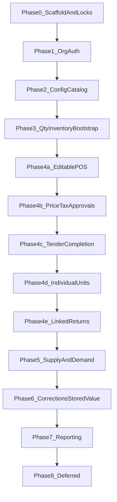

# ShelfStack Implementation Roadmap

**Status:** Active  
**Approach:** POS-forward delivery  
**Current phase:** [current-phase.md](current-phase.md)  
**Locks:** [architectural-locks.md](architectural-locks.md)  
**Open decisions:** [open-decisions.md](open-decisions.md)  
**Git workflow:** [git-workflow.md](git-workflow.md)

## Central decision

Full purchasing and product-request workflows must **not** block a real, inventory-aware POS completion path.

The first vertical slice is:

```text
opening inventory adjustment
→ quantity reservation
→ atomic POS completion
→ inventory movement + cost snapshot + receipt number
```

Purchase orders do not create on-hand stock, so they are not a prerequisite for that slice.

## Delivery sequence



| Phase | Name | Status | Document |
| --- | --- | --- | --- |
| 0 | Scaffold and architectural locks | Complete | [phases/phase-00-scaffold-and-locks.md](phases/phase-00-scaffold-and-locks.md) |
| 1 | Organization and authorization | Complete | [phases/phase-01-organization-and-authorization.md](phases/phase-01-organization-and-authorization.md) |
| 2 | Configuration and catalog | Not started | [phases/phase-02-configuration-and-catalog.md](phases/phase-02-configuration-and-catalog.md) |
| 3 | Quantity inventory bootstrap | In review (hardening) | [phases/phase-03-quantity-inventory-bootstrap.md](phases/phase-03-quantity-inventory-bootstrap.md) |
| 4 | Point of sale (4a–4e) | Not started | [phases/phase-04-point-of-sale.md](phases/phase-04-point-of-sale.md) |
| 5 | Supply and demand | Not started | [phases/phase-05-supply-and-demand.md](phases/phase-05-supply-and-demand.md) |
| 6 | Corrections and stored value | Not started | [phases/phase-06-corrections-and-stored-value.md](phases/phase-06-corrections-and-stored-value.md) |
| 7 | Reporting and reconciliation | Not started | [phases/phase-07-reporting-and-reconciliation.md](phases/phase-07-reporting-and-reconciliation.md) |
| 8 | Deferred capabilities | Deferred | [deferred-capabilities.md](deferred-capabilities.md) |

## Mapping to system-overview §1.8

Conceptual phases in the System Overview describe domain dependencies. Delivery phases reorder work for an earlier completed-sale milestone.

| System Overview | Delivery phase | Notes |
| --- | --- | --- |
| Phase 1 Org / auth | Delivery Phase 1 | Same |
| Phase 2 Definitions / catalog | Delivery Phase 2 | Same; no display categories |
| Phase 3 Requests / purchasing | Delivery Phase 5 | After first POS completion |
| Phase 4 Receiving / inventory | Delivery Phase 3 (thin bootstrap) + Phase 5 (full receiving) | Bootstrap uses adjustments only |
| Phases 5–7 POS | Delivery Phase 4a–4e | Pulled forward |
| Phase 8 Corrections / stored value | Delivery Phase 6 | Same |
| Phase 9 Reporting | Delivery Phase 7 | Same |
| Phase 10 Later extensions | Delivery Phase 8 / deferred | Same |

## Cross-cutting engineering rules

- Prefer application services for multi-record workflows; models enforce local invariants.
- Store monetary amounts in integer cents.
- Deactivate master records rather than deleting them when history may reference them.
- Add database constraints for critical uniqueness and concurrency.
- Only inventory movements posted through ledger services change `on_hand`.
- Do not invent deferred workflows (see [deferred-capabilities.md](deferred-capabilities.md)).
- Tests scale with risk: concurrency and idempotency required for inventory, money, and completion.

## Near-term cadence

1. Phase 0 — scaffold, locks, classification-field audit  
2. Phase 1 — auth and store context  
3. Phase 2 — catalog and identifiers  
4. Phase 3 — quantity bootstrap, opening cost, negative-stock tests  
5. Store tax rates/rules → Phase 4a → 4b → 4c (first completed sale)  
6. Phase 4d individual units; Phase 4e linked returns  
7. Phase 5 purchasing, receiving, minimal customer, requests  
8. Phases 6–7 as separate epics  

## Schema and seed inputs

- Reconciled proforma: [../exports/schema/](../exports/schema/)
- Classification seed CSVs: [../exports/departments.csv](../exports/departments.csv), [../exports/tax_categories.csv](../exports/tax_categories.csv), [../exports/merchandise_classes.csv](../exports/merchandise_classes.csv)
- Pre-scaffolding reconciliation note: [schema-reconciliation-display-categories-and-demand-allocation.md](schema-reconciliation-display-categories-and-demand-allocation.md)

Migrations and `db/schema.rb` become implemented truth. Conflicts with ADRs or Domain Specifications must be resolved explicitly.
