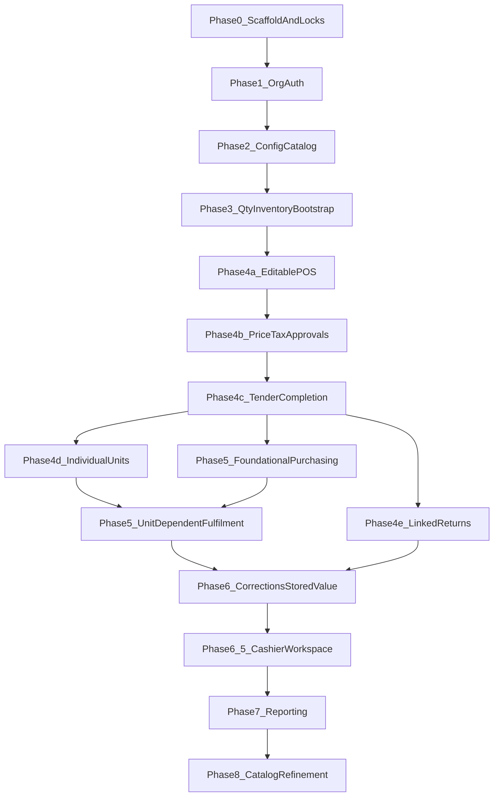

# ShelfStack Implementation Roadmap

**Status:** Active  
**Approach:** POS-forward delivery  
**Current phase:** [current-phase.md](current-phase.md)  
**Locks:** [architectural-locks.md](architectural-locks.md)  
**Open decisions:** [open-decisions.md](open-decisions.md)  
**Carry-forward backlog:** [deferred-work-register.md](deferred-work-register.md)  
**Design (cross-cutting):** [../design/README.md](../design/README.md)  
**Git workflow:** [git-workflow.md](git-workflow.md)


## Central decision

Full purchasing and product-request workflows must **not** block a real, inventory-aware POS completion path.

The first vertical slice is:

```text
opening inventory adjustment
→ quantity reservation
→ atomic POS completion
→ inventory movement + cost snapshot + receipt number
```

Purchase orders do not create on-hand stock, so they are not a prerequisite for that slice.

## Delivery sequence




| Phase | Name | Status | Document |
| --- | --- | --- | --- |
| 0 | Scaffold and architectural locks | Complete | [phases/phase-00-scaffold-and-locks.md](phases/phase-00-scaffold-and-locks.md) |
| 1 | Organization and authorization | Complete | [phases/phase-01-organization-and-authorization.md](phases/phase-01-organization-and-authorization.md) |
| 2 | Configuration and catalog | Complete | [phases/phase-02-configuration-and-catalog.md](phases/phase-02-configuration-and-catalog.md) |
| 3 | Quantity inventory bootstrap | Complete | [phases/phase-03-quantity-inventory-bootstrap.md](phases/phase-03-quantity-inventory-bootstrap.md) |
| 4 | Point of sale (4a–4e) + UX Baseline (4f) | Complete — merged to `main` at `34f371f` (PR #30) | [phases/phase-04-point-of-sale.md](phases/phase-04-point-of-sale.md), [phases/phase-04f-ux-baseline.md](phases/phase-04f-ux-baseline.md) |
| 4g | Test hardening | Complete — merged to `main` at `c51dcca` (PR #31) | [phases/phase-04g-test-hardening.md](phases/phase-04g-test-hardening.md) |
| 5 | Supply and demand | Complete — merged to `main` at `2e3e119` (PR #34) | [phases/phase-05-supply-and-demand.md](phases/phase-05-supply-and-demand.md) |
| 6 | Corrections and stored value | Complete — merged to `main` at `853ae3b` (PR [#39](https://github.com/tswarren/shelfstack-5/pull/39); [#36](https://github.com/tswarren/shelfstack-5/issues/36) closed) | [phases/phase-06-corrections-and-stored-value.md](phases/phase-06-corrections-and-stored-value.md) |
| 6.5 | Cashier workspace | Complete — merged to `main` at `bd7fb9d35469027a60c9d3277744fda0a0ed06d9` (PR [#54](https://github.com/tswarren/shelfstack-5/pull/54)) | [phases/phase-06.5-cashier-workspace.md](phases/phase-06.5-cashier-workspace.md) |
| 7 | Reporting and reconciliation | Complete — core 7a–7d merged to `main` at `d27d666` (PR [#62](https://github.com/tswarren/shelfstack-5/pull/62)); 7e partial ([#94](https://github.com/tswarren/shelfstack-5/issues/94)) | [phases/phase-07-reporting-and-reconciliation.md](phases/phase-07-reporting-and-reconciliation.md) |
| 8 | Catalog refinement & enrichment | Ready for implementation — not started; plan [phase-08…](phases/phase-08-catalog-refinement-and-enrichment.md); decisions [phase-08…v1](decisions/phase-08-catalog-refinement-and-enrichment-v1.md); later extensions [deferred-capabilities.md](deferred-capabilities.md) | [deferred-work-register.md](deferred-work-register.md), [deferred-capabilities.md](deferred-capabilities.md) |

## Mapping to system-overview §1.8

Conceptual phases in the System Overview describe domain dependencies. Delivery phases reorder work for an earlier completed-sale milestone.

| System Overview | Delivery phase | Notes |
| --- | --- | --- |
| Phase 1 Org / auth | Delivery Phase 1 | Same |
| Phase 2 Definitions / catalog | Delivery Phase 2 | Same; no display categories |
| Phase 3 Requests / purchasing | Delivery Phase 5 | After first POS completion |
| Phase 4 Receiving / inventory | Delivery Phase 3 (thin bootstrap) + Phase 5 (full receiving) | Bootstrap uses adjustments only |
| Phases 5–7 POS | Delivery Phase 4a–4e | Pulled forward |
| Phase 8 Corrections / stored value | Delivery Phase 6 | Same |
| — | Delivery Phase 6.5 | Cashier interaction gate (not a system-overview phase) |
| Phase 9 Reporting | Delivery Phase 7 | Same |
| Phase 10 Later extensions | Later extensions ([deferred-capabilities.md](deferred-capabilities.md)); delivery Phase 8 is catalog refinement | See [deferred-work-register.md](deferred-work-register.md) |

## Cross-cutting engineering rules

- Prefer application services for multi-record workflows; models enforce local invariants.
- Store monetary amounts in integer cents.
- Deactivate master records rather than deleting them when history may reference them.
- Add database constraints for critical uniqueness and concurrency.
- Only inventory movements posted through ledger services change `on_hand`.
- Do not invent deferred workflows (see [deferred-capabilities.md](deferred-capabilities.md)).
- Tests scale with risk: concurrency and idempotency required for inventory, money, and completion.
- UI/UX is a cross-cutting responsibility ([../design/](../design/README.md)): mockups are a north star, not business-logic contracts. The **UX Baseline Gate** (Phase 4f) must complete before Phase 5 so new screens inherit shared shell, form, table, and page patterns.

## Near-term cadence

Completed: Phases 0–7 core delivery. Phase 7 Reporting and Reconciliation merged to `main` at `d27d666` (PR [#62](https://github.com/tswarren/shelfstack-5/pull/62); 7e partial [#94](https://github.com/tswarren/shelfstack-5/issues/94)). Phase 6.5 at `bd7fb9d` (PR [#54](https://github.com/tswarren/shelfstack-5/pull/54)). Phase 6 at `853ae3b` (PR [#39](https://github.com/tswarren/shelfstack-5/pull/39)). Phase 5 at `2e3e119` (PR #34).

**Next:** Phase 8 — Catalog refinement & enrichment (ready for implementation). Plan: [phase-08-catalog-refinement-and-enrichment.md](phases/phase-08-catalog-refinement-and-enrichment.md). See [current-phase.md](current-phase.md).

**Carry-forward backlog:** [deferred-work-register.md](deferred-work-register.md) (open decisions, interim correction blocks, Phase 7 follow-ups [#89](https://github.com/tswarren/shelfstack-5/issues/89)–[#94](https://github.com/tswarren/shelfstack-5/issues/94), catalog Phase 8 candidates, later extensions).

1. Promote Phase 8 phase plan from the temp draft; start with linking UX + create-from-ISBN.
2. Retain OD-014 interim and return-txn post-void blocks until their follow-on algorithms land.
3. Keep residual open decisions (OD-009, OD-010, OD-013) tracked; do not close OD-010 when adding aggregate `unavailable_delta`.
4. Optional ops hardening: [#51](https://github.com/tswarren/shelfstack-5/issues/51); DWR-018/019 control masters and store settings UI.


## Schema and seed inputs

- Reconciled proforma CSVs and workbook: [../exports/schema/](../exports/schema/)
- Current reconciliation workbook: [../exports/schema/ShelfStack_Schema_Reconciliation_2026-07-20.xlsx](../exports/schema/ShelfStack_Schema_Reconciliation_2026-07-20.xlsx)
- Classification seed CSVs: [../exports/departments.csv](../exports/departments.csv), [../exports/tax_categories.csv](../exports/tax_categories.csv), [../exports/merchandise_classes.csv](../exports/merchandise_classes.csv)
- Pre-scaffolding reconciliation note: [schema-reconciliation-display-categories-and-demand-allocation.md](schema-reconciliation-display-categories-and-demand-allocation.md)

Migrations and `db/schema.rb` become implemented truth. Conflicts with ADRs or Domain Specifications must be resolved explicitly.
