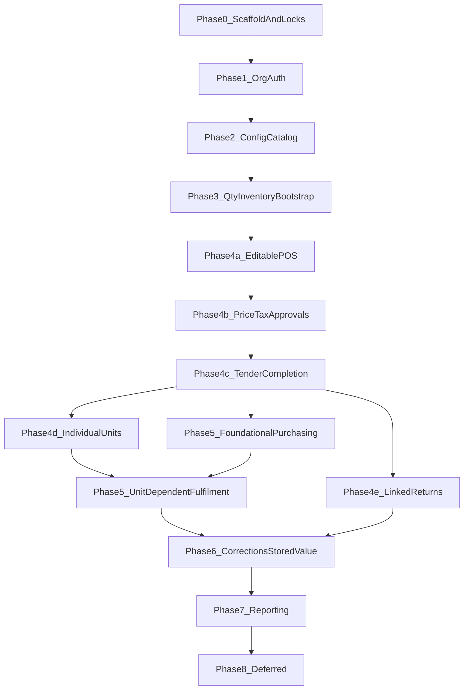

# ShelfStack Implementation Roadmap

**Status:** Active  
**Approach:** POS-forward delivery  
**Current phase:** [current-phase.md](current-phase.md)  
**Locks:** [architectural-locks.md](architectural-locks.md)  
**Open decisions:** [open-decisions.md](open-decisions.md)  
**Design (cross-cutting):** [../design/README.md](../design/README.md)  
**Git workflow:** [git-workflow.md](git-workflow.md)


## Central decision

Full purchasing and product-request workflows must **not** block a real, inventory-aware POS completion path.

The first vertical slice is:

```text
opening inventory adjustment
→ quantity reservation
→ atomic POS completion
→ inventory movement + cost snapshot + receipt number
```

Purchase orders do not create on-hand stock, so they are not a prerequisite for that slice.

## Delivery sequence



| Phase | Name | Status | Document |
| --- | --- | --- | --- |
| 0 | Scaffold and architectural locks | Complete | [phases/phase-00-scaffold-and-locks.md](phases/phase-00-scaffold-and-locks.md) |
| 1 | Organization and authorization | Complete | [phases/phase-01-organization-and-authorization.md](phases/phase-01-organization-and-authorization.md) |
| 2 | Configuration and catalog | Complete | [phases/phase-02-configuration-and-catalog.md](phases/phase-02-configuration-and-catalog.md) |
| 3 | Quantity inventory bootstrap | Complete | [phases/phase-03-quantity-inventory-bootstrap.md](phases/phase-03-quantity-inventory-bootstrap.md) |
| 4 | Point of sale (4a–4e) | Implemented on `phase/p4-point-of-sale` (not merged to `main` pending manual testing) | [phases/phase-04-point-of-sale.md](phases/phase-04-point-of-sale.md) |
| 5 | Supply and demand | Not started — foundational purchasing may start after 4c; complete 4d before individual-item fulfilment | [phases/phase-05-supply-and-demand.md](phases/phase-05-supply-and-demand.md) |
| 6 | Corrections and stored value | Not started | [phases/phase-06-corrections-and-stored-value.md](phases/phase-06-corrections-and-stored-value.md) |
| 7 | Reporting and reconciliation | Not started | [phases/phase-07-reporting-and-reconciliation.md](phases/phase-07-reporting-and-reconciliation.md) |
| 8 | Deferred capabilities | Deferred | [deferred-capabilities.md](deferred-capabilities.md) |

## Mapping to system-overview §1.8

Conceptual phases in the System Overview describe domain dependencies. Delivery phases reorder work for an earlier completed-sale milestone.

| System Overview | Delivery phase | Notes |
| --- | --- | --- |
| Phase 1 Org / auth | Delivery Phase 1 | Same |
| Phase 2 Definitions / catalog | Delivery Phase 2 | Same; no display categories |
| Phase 3 Requests / purchasing | Delivery Phase 5 | After first POS completion |
| Phase 4 Receiving / inventory | Delivery Phase 3 (thin bootstrap) + Phase 5 (full receiving) | Bootstrap uses adjustments only |
| Phases 5–7 POS | Delivery Phase 4a–4e | Pulled forward |
| Phase 8 Corrections / stored value | Delivery Phase 6 | Same |
| Phase 9 Reporting | Delivery Phase 7 | Same |
| Phase 10 Later extensions | Delivery Phase 8 / deferred | Same |

## Cross-cutting engineering rules

- Prefer application services for multi-record workflows; models enforce local invariants.
- Store monetary amounts in integer cents.
- Deactivate master records rather than deleting them when history may reference them.
- Add database constraints for critical uniqueness and concurrency.
- Only inventory movements posted through ledger services change `on_hand`.
- Do not invent deferred workflows (see [deferred-capabilities.md](deferred-capabilities.md)).
- Tests scale with risk: concurrency and idempotency required for inventory, money, and completion.
- UI/UX is a cross-cutting responsibility ([../design/](../design/README.md)): a short readiness gate precedes Phase 4a; POS UI and transaction semantics develop together; broader consolidation is planned for Phase 5. Mockups are a north star, not business-logic contracts.

## Near-term cadence

Completed: Phases 0–3; Phase 4a–4e implemented on `phase/p4-point-of-sale` (merge to `main` only after manual testing).

**Phase 5 unlock (Option B):** Phase 5 *foundational* purchasing (vendors, POs, quantity receiving, requests/allocations against quantity inventory) may begin after **4c**. Complete **4d before any individual-item Phase 5 work** (unit-backed receiving, unit-linked request fulfilment, exact-copy supply). Phase 4e is recommended before broad return/refund-oriented fulfilment but is not a hard gate for foundational purchasing.

1. Manually accept Phase 4 on `phase/p4-point-of-sale` before merge to `main`  
2. Phase 5 foundational purchasing / receiving / requests (may proceed while 4d/4e were finishing; 4d is now available for unit-dependent paths)  
3. First app-wide UX consolidation during or after early Phase 5  
4. Phases 6–7 as separate epics  


## Schema and seed inputs

- Reconciled proforma: [../exports/schema/](../exports/schema/)
- Classification seed CSVs: [../exports/departments.csv](../exports/departments.csv), [../exports/tax_categories.csv](../exports/tax_categories.csv), [../exports/merchandise_classes.csv](../exports/merchandise_classes.csv)
- Pre-scaffolding reconciliation note: [schema-reconciliation-display-categories-and-demand-allocation.md](schema-reconciliation-display-categories-and-demand-allocation.md)

Migrations and `db/schema.rb` become implemented truth. Conflicts with ADRs or Domain Specifications must be resolved explicitly.
